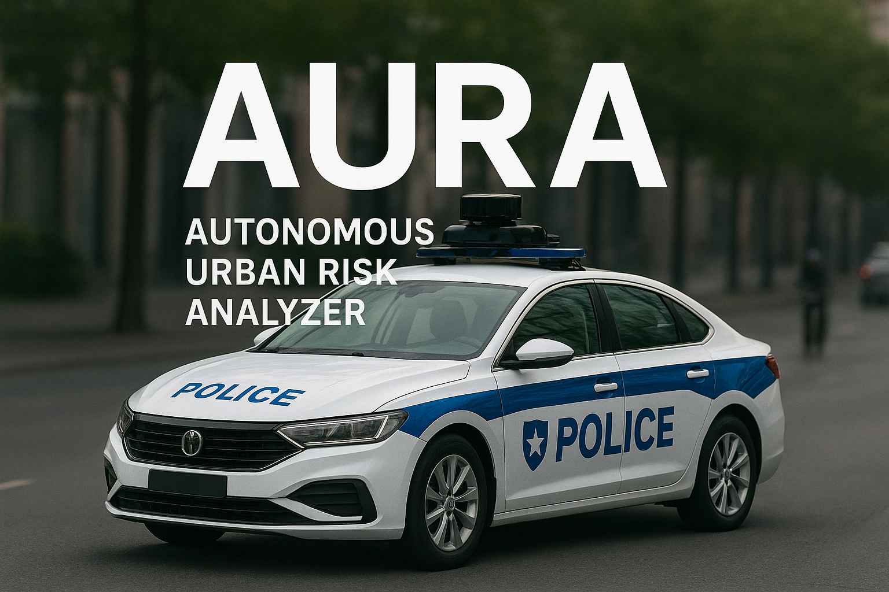
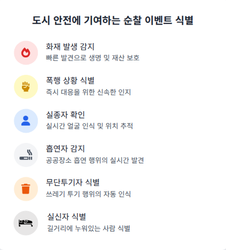
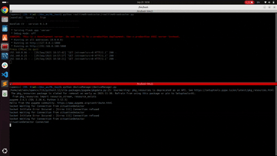
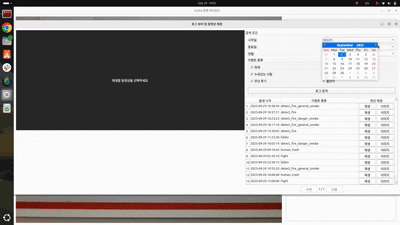
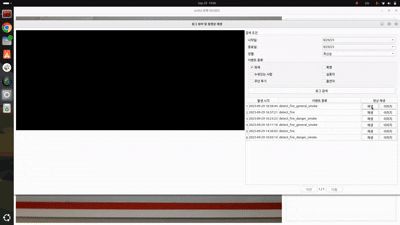
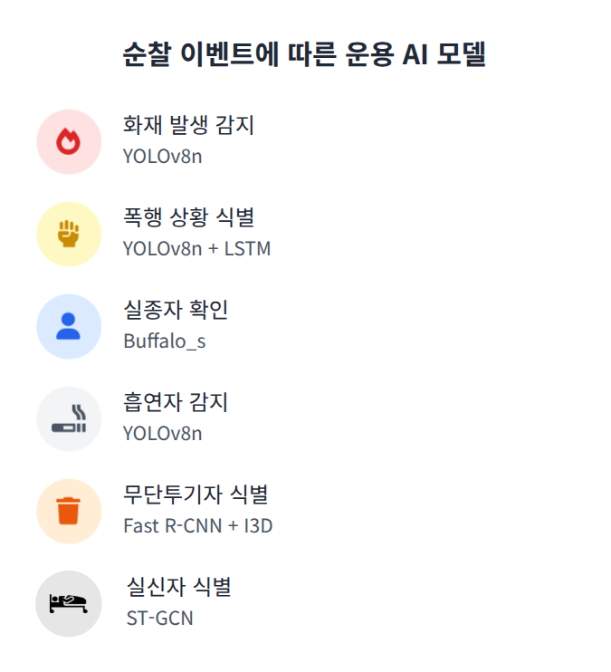
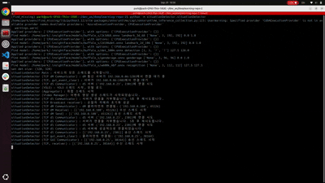

# ​AURA (Autonomous Urban Risk Analyzer)

<p align="center">
  
</p>

<p align="center">
  <strong>자율주행 순찰차를 위한 <br>AI 기반 상황 감지 및 대응 시스템</strong>
</p>

<p align="center">
  <a href="https://www.apache.org/licenses/LICENSE-2.0">
    
  </a>
  <a href="https://docs.google.com/presentation/d/1OvluDI2SC733bY-mDKR4HCJCvMPAkhUB/edit?usp=sharing&ouid=103769023187000268570&rtpof=true&sd=true">
    
  </a>

  </a>
</p>
  
## 📖 목차

* 1.[프로젝트 개요](#프로젝트-개요)
* 2.[시스템 아키텍쳐](#시스템-아키텍쳐)
* 3.[AI 모델 개발](#AI-모델-개발)
* 4.[성능 평가 및 결과](#성능-평가-및-결과)
* 5.[결론](#결론)
* 6.[향후 계획](#향후-계획)

***

## 1. 프로젝트 개요

### 프로젝트 소개


'AURA'는 Autonomous Urban Risk Analyzer의 약어로, 자율주행 순찰차의 실시간 상황 인식 및 대응으로 **순찰 효율성**과 **대응 신속성**을 높여 경찰의 순찰업무를 지원하는 시스템입니다.

### 프로젝트 기간
 - 2025년 09월 02일 ~ 2025월 10월 02월

### 기술 스택 

| 분류 | 사용 기술 |
| :--- | :--- |
| **AI / Deep Learning** |     |
| **Development** |    |
| **GUI & Database** |   
| **Collaboration** |     |

### 팀 구성


| 이름 | 역할 | 담당 업무 |
| :--- | :--- | :--- |
| **조성래** | 팀장 | 팀 관리, 관제 메인 GUI 개발, 쓰레기 무단 투기 AI 개발 |
| **박재오** | 팀원 | AI 운용 및 Ethernet 기반 통신 서버 개발, 화재 발생 식별 AI 개발 |
| **손성경** | 팀원 | AI 기능 통합 및 메타 데이터 구조 설계, 실신자 식별 AI 개발 |
| **이건창** | 팀원 | 순찰 이벤트 저장 데이터베이스 개발, 폭행 상황 식별 AI 개발 |
| **이 수** | 팀원 | 프로젝트 관리, 시스템 아키텍처 및 운용 시나리오 설계,<br/> 순찰차 탑재 소프트웨어 개발, 흡연자 식별 AI 개발 |
| **최승혁** | 팀원 | 순찰 이벤트 검색 GUI 개발, 실종자 식별 AI 개발 |


### 라이센스
이 프로젝트는 [Apache License 2.0](https://www.apache.org/licenses/LICENSE-2.0)에 따라 오픈소스로 제공됩니다.
자세한 사항은 [`LICENSE`](./LICENSE) 파일을 참고해주세요.


## 2. 주요 기능

<table>
  <tr>
    <th align="center" style="width:15%">주요 기능</th>
    <th style="width:80%">설명</th>
    <th style="width:35%">이미지</th>
  </tr>
  <tr>
    <td><b>AI 기반 상황 인식 &nbsp;&nbsp;&nbsp;&nbsp;&nbsp;&nbsp;&nbsp;&nbsp;&nbsp;&nbsp;&nbsp;&nbsp;&nbsp;&nbsp;&nbsp;&nbsp;&nbsp;&nbsp;&nbsp;&nbsp;&nbsp;&nbsp;&nbsp;&nbsp;
 </b></td>
    <td>
        AURA는 6가지 주요 상황 발생 이벤트<br>(화재, 폭행, 실종자, 실신자, 흡연자, 실신자)를 <br/> AI 영상 인식 기능으로 신속하게 확인합니다.
    </td>
    <td align="center">
        
    </td>
  </tr>
  <tr>
    <td><b>시간 상황 대응 및 <br>알림 발생</b></td>
    <td>
  AURA는 발생된 이벤트를 사용자에 알려주고, <br/> 순찰차의 경고 방송을 통해 각 상황에 대응합니다.
    </td>
    <td align="center">
      <br>
      
    </td>
  </tr>
  <tr>
    <td><b>상황 기록 아카이빙 및 검색
 </b></td>
    <td>
  AURA는 이전에 발생된 이벤트를 데이터베이스에 저장하고, <br/> 사용자는 이벤트 발생 기록과 캡처 영상을 확인할 수 있습니다.
    </td>
    <td align="center">
       <br>
      
    </td>
  </tr>
</table>


## 3. 핵심 기술
AURA의 개발에 적용된 핵심 기술은 다음과 같습니다.

### 각 이벤트 인식에 적합한 개별 상황인식 AI 운용

<p align="center">
  <br>
  <sub>각 상황 식별을 위한 AI 모델 종류</sub>
</p>

 - 각 상황에 대한 정확한 인식을 위해 개별적인 AI를 운용하여 각 상황의 **인식 정확성**을 높였습니다.

### 실시간 영상 송출 및 AI 메타 데이터 통신 이분화

<p align="center">
  <br>
  <sub>AI 기반 이벤트 식별 기능의 독립적인 운용</sub>
</p>

 - 순찰차의 영상 통신과 AI 메타 데이터 통신의 이분화를 통해 관제의 **실시간성과 통신 효율성**을 높였습니다.
   
## 4. 시스템 설계

<details>
  <summary><span style="cursor:pointer;">하드웨어 아키텍처</span></summary>
  <p align="center">
    
  </p>
</details>

<details>
  <summary><span style="cursor:pointer;">소프트웨어 아키텍처</span></summary>
  <p align="center">
    
  </p>
</details>

## 5. 프로젝트 구조

```
AURA/
├── dataService/                        # 순찰 이벤트 메타데이터 및 캡처 영상 관리 모듈
│   ├── server_config.py                # DB 접속 정보 및 통신 포트 관리
│   └── server.py                       # dataService 메인 모듈
│
├── deviceManager/                      # 순찰 관제GUI
│   ├── embedmediaStorage/              # 순찰 이벤트 방송 효과음
│   ├── include/                  
│   ├── lib/             
│   ├── CMakeList.txt                   # deviceManager 컴파일 및 빌드 파일
│   ├── deviceManager.bash              # deviceManager 실행 파일
│   ├── TCPClientManager.cpp            # TCP 통신용 모듈
│   └── deviceManager.cpp               # deviceManager 메인 모듈
│
├── monitoringGUI/                      # 순찰 관제GUI
│   ├── alert/                          # 순찰 이벤트 알림 효과음
│   ├── log_viewer.ui                  
│   ├── main_dashboard.ui             
│   ├── log_viewer.py                   # 순찰 이벤트 기록 검색 GUI
│   └── main_dashboard.py               # monitoringGUI 메인 모듈
│
├── realtimeBroadcaster/                # 실시간 영상 송출 모듈
│   ├── camerasetup.py                  # 카메라 연결 및 실행 모듈
|   ├── realtimeBroadcaster.py          # realtimeBroadcaster 메인 모듈
│   └── server.py                       # 송출용 서버 실행 모듈
│
├── situationDetector/                  # AI 동작 및 순찰 이벤트 송신 모듈
│   ├── detect/                         # AI 모델 관리 폴더
|       ├── feat_detect_fall/           # 실신자 식별 AI
|       ├── feat_detect_fire/           # 화재 상황 식별 AI
|       ├── feat_detect_smoke/          # 흡연자 식별 AI
|       ├── feat_detect_trash/          # 쓰레기 무단 투기 식별 AI
|       ├── feat_detect_violence/       # 폭령 상황 식별 AI
|       └── feat_find_missing/          # 실종자 식별 AI
|
│   ├── receiver/                       # TCP 통신 클라이언트 모듈
│   ├── server/                         # TCP 통신 서버 모듈           
│   ├── situationDetector.py            # situationDetector 메인 모듈
│   └── videoManager.py                 # 순찰 이벤트 영상 캡처 모듈
│
├── assets/                            # 이미지 및 리소스 파일
│
├── .gitignore
├── README.md
└── LICENSE
```

---


## 5. 결론

### 개발 의의

<p align="center">
  AURA는 자율주행 순찰차를 통한 <b>도시 안전과 치안 유지</b>에 기여하고자 합니다.
</p>

* 신속한 이벤트 대응으로 도시 안정성을 향상
* 인력 배치 최적화로 순찰 효율성 증대
* 지속적인 모니터링으로 이벤트 재발 방지 효과 기대


